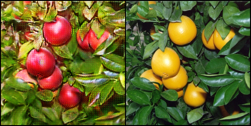
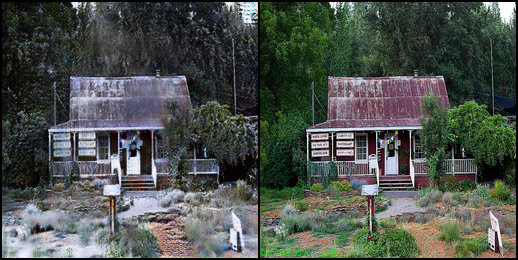
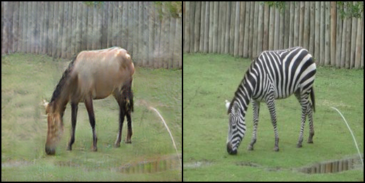

# Homework 1 (Color-Transfer and Texture-Transfer)

A clean and readable Pytorch implementation of CycleGAN (https://arxiv.org/abs/1703.10593)
## Assign

1.  20% (Training cycleGAN)
2.  10% (Inference cycleGAN in personal image)
3.  20% (Compare with other method)
4.  30% (Assistant) 
5.  20% (Mutual evaluation)


## Getting Started
Please first install [Anaconda](https://anaconda.org) and create an Anaconda environment using the environment.yml file.

```
conda env create -f environment.yml
```

After you create the environment, activate it.
```
source activate hw1
```

Our current implementation only supports GPU so you need a GPU and need to have CUDA installed on your machine.

## Training
### 1. Download dataset
```
mkdir datasets
bash ./download_dataset.sh <dataset_name>
```
Valid <dataset_name> are: apple2orange, summer2winter_yosemite, horse2zebra, monet2photo, cezanne2photo, ukiyoe2photo, vangogh2photo, maps, cityscapes, facades, iphone2dslr_flower, ae_photos

Alternatively you can build your own dataset by setting up the following directory structure:

    .
    ├── datasets                   
    |   ├── <dataset_name>         # i.e. apple2orange
    |   |   ├── trainA             # Contains domain A images (i.e. apple)
    |   |   ├── trainB             # Contains domain B images (i.e. orange) 
    |   |   ├── testA              # Testing
    |   |   └── testB              # Testing
    
### 2. Train
```
python train.py --dataroot datasets/<dataset_name>/ --cuda
```
This command will start a training session using the images under the *dataroot/train* directory with the hyperparameters that showed best results according to CycleGAN authors. 

Both generators and discriminators weights will be saved ```./output/<dataset_name>/``` the output directory.

If you don't own a GPU remove the --cuda option, although I advise you to get one!


## Testing
```
python test.py --dataroot datasets/<dataset_name>/ --cuda
```
This command will take the images under the ```dataroot/testA/``` and ```dataroot/testB/``` directory, run them through the generators and save the output under the ```./output/<dataset_name>/``` directories. 

Examples of the generated outputs (default params) apple2orange, summer2winter_yosemite, horse2zebra dataset:






## Acknowledgments
Code is modified by [PyTorch-CycleGAN](https://github.com/aitorzip/PyTorch-CycleGAN). All credit goes to the authors of [CycleGAN](https://arxiv.org/abs/1703.10593), Zhu, Jun-Yan and Park, Taesung and Isola, Phillip and Efros, Alexei A.
